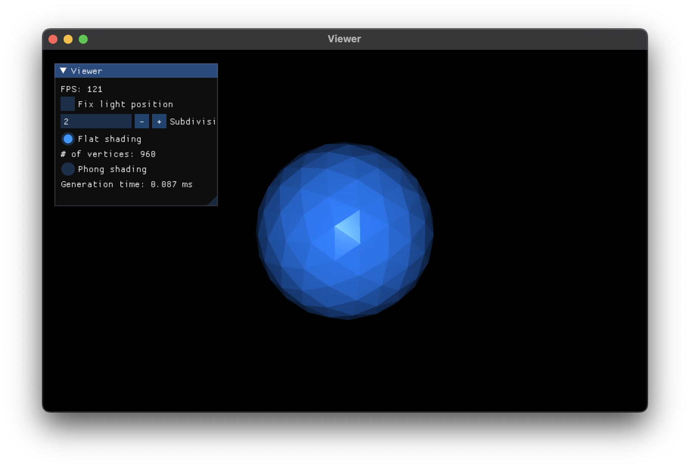

# Icosphere

[](https://opensource.org/licenses/MIT)



## How to use

- Pan mouse to rotate camera.
- Scroll mouse to zoom in/out.
- Flat shading use normals per face. Phong shading use normals per vertex. Phong shading uses vertex normal as its own 
position (since its position is normalized, outward from the center of the sphere), therefore it can be drawn with indexing
and more efficient (switch the shading type to see the difference of used vertices and indices count).

## How to build

### Dependencies

- [GLFW](https://github.com/glfw/glfw)
- [GLEW](https://github.com/nigels-com/glew)
- [glm](https://github.com/g-truc/glm)
- [imgui](https://github.com/ocornut/imgui)

Dependencies can be fetched using vcpkg included in the project files. CMake is used for build system.

### Build step

```shell
git clone https://github.com/stripe2933/icosphere.git
cd icosphere
mkdir build
cd build
cmake ..
cmake --build .
```